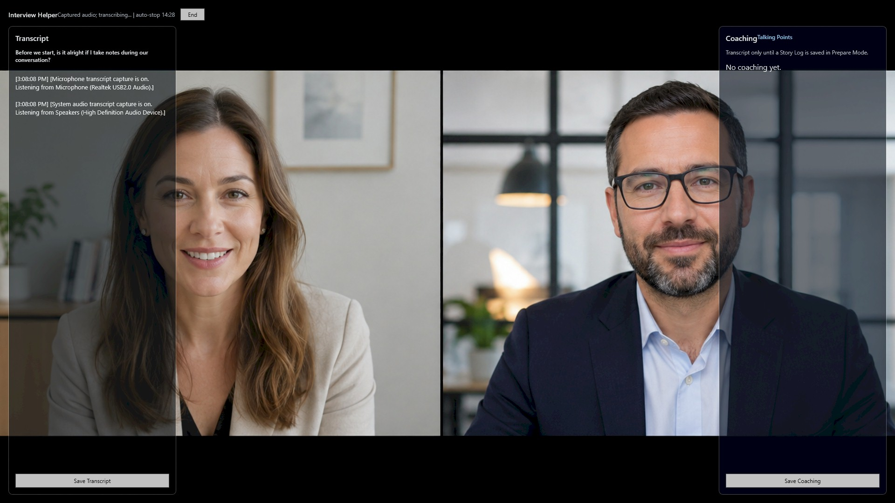

# Interview Helper

A free Windows app that turns your interview prep into a private set of notes,
then surfaces the right talking points while the conversation is happening. You
prepare the material in advance. During the meeting, Interview Helper listens for
questions, matches them to your Story Log, and keeps relevant reminders handy in
a transparent overlay only you can see.

It does not speak, play audio, type into the meeting, or invent answers for you.
If your prepared notes do not cover the moment, it stays quiet.

> **Status:** Free to download and use. Closed-source. Bring your own OpenAI API
> key. Windows 10/11 only.

## Download

Grab the latest build from the [Releases](../../releases) page, unzip it, and run
`InterviewHelper.exe`. There is no installer to fight with and no account to
create. The first time you open it, add your own OpenAI API key in Settings and
you are ready.

If Windows SmartScreen warns about an unrecognized app, choose **More info ->
Run anyway**. The build is unsigned today; code signing is planned.

You bring your own OpenAI API key. If you do not have one,
[Getting Your OpenAI API Key](docs/Getting-Your-OpenAI-API-Key.md) walks through
it in about five minutes. **Interview Helper works with OpenAI only right now** —
Anthropic (Claude) support is designed for but not yet built, so an Anthropic key
will not work in this version.

## What It Does

Interview Helper has four modes.

**Test Mode** checks that your microphone, system audio, OpenAI key, and the
overlay all work before you rely on them in a real call.

**Prepare Mode** lets you choose an Interview Packet Folder, then select or
create a session folder inside it for each interview. Drop in your own
background material — resume, brag sheet, notes, prior answers — as `.md`,
`.txt`, `.docx`, or text-based `.pdf`; the app copies those files into the
selected session folder and builds a reusable Story Log of your real evidence:
narratives, dated examples, themes, and the kinds of questions each one answers.

**Interview Mode** opens a transparent, always-on-top notes overlay with two
rails. The left rail shows a live transcript of the conversation. The right rail
shows short talking points from your Story Log when the interviewer asks
something your prepared evidence actually covers. Transcript and talking-points
notes autosave to the active session folder and can also be saved explicitly from
the overlay. If nothing matches, it stays quiet rather than filling the space
with generic advice.

**Score Interview** reviews a live or saved transcript and gives a practical
scorecard across clarity, evidence strength, role alignment, answer structure,
and follow-up quality. When a transcript is saved or a call ends, the active
session transcript is loaded for review. A follow-up thank you letter can be
generated from the transcript, notes, and score feedback and saved to the same
session folder.

The live notes overlay is built to stay out of the way. It ignores small talk and
logistics, recognizes interviewer questions by shape rather than exact wording,
does not repeat the same prepared note unless the question is meaningfully
rephrased, and keeps direct factual prompts short.

## How Much It Costs To Run

The app is free. You pay OpenAI directly for what you use, with your own key.

For a 30-minute conversation, current OpenAI pricing puts live transcription at
roughly **$0.51**. Talking-point retrieval usually adds a few cents because it
only runs on interview-relevant turns and is capped to short responses. Settings
include cost-safety stops: the overlay shuts transcription down when you close
it, after a maximum runtime, or after an idle period with no new speech.

## Privacy

Everything runs on your machine. There is no Interview Helper account, server, or
hosted database.

- Your OpenAI API key is stored in **Windows Credential Manager**, not in any
  file in the app folder and not inside the program itself.
- Settings are stored per Windows account under
  `%LocalAppData%\InterviewHelper\settings.json`.
- Audio is sent to OpenAI only for transcription and is not saved by default.
- Transcript and talking-points notes autosave locally to the active session
  folder and can be saved explicitly from the overlay. Diagnostic logs live
  under `%LocalAppData%\InterviewHelper\logs`.

**Your data stays on your machine.** The downloaded program contains no key,
settings, or interview content. Those are read from your own Windows account at
runtime, so a fresh install on another computer or user account starts blank.
The only way someone sees your data is if they are signed into your Windows
account.

## Responsible Use

This app can capture the other person's audio from your call. You are
responsible for using it lawfully and ethically. Recording or processing a
conversation can require the other party's consent depending on where you and
they are located, and may be restricted by the terms of the meeting platform you
use. Check the rules that apply to you before you rely on it in a live call.

## Requirements

- Windows 10 or 11 (64-bit).
- A working microphone and standard system audio. The app captures your mic plus
  Windows system-audio loopback so it can hear both sides of a call.
- An OpenAI API account and key with billing enabled.
- The release build is self-contained, so a separate .NET install is not
  required.

## About This Project (Portfolio Note)

Beyond being a usable tool, Interview Helper is a portfolio piece. It is a
native Windows desktop application that solves a real-time problem end to end:

- Live dual-source audio capture (microphone plus system-audio loopback) with a
  transparent, screen-share-aware overlay.
- Evidence-grounded note retrieval. Talking points are anchored to a user-built
  Story Log, and the model is constrained to surface material only when prepared
  evidence matches the question - a deliberate guard against generic, made-up
  answers.
- Practical cost and privacy controls: per-session spend stops, local-only logs,
  and OS credential storage for the API key.

The source is kept private. What you can evaluate here is the working product,
its behavior, and the design decisions behind it.

## License

Free to use, not open source. See [EULA.md](EULA.md). In short: you may download
and run it for your own interview preparation at no cost, but you may not
redistribute, modify, decompile, or repurpose it. It is provided as is, with no
warranty.

---

Created by Marco Policani.
